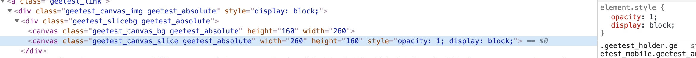
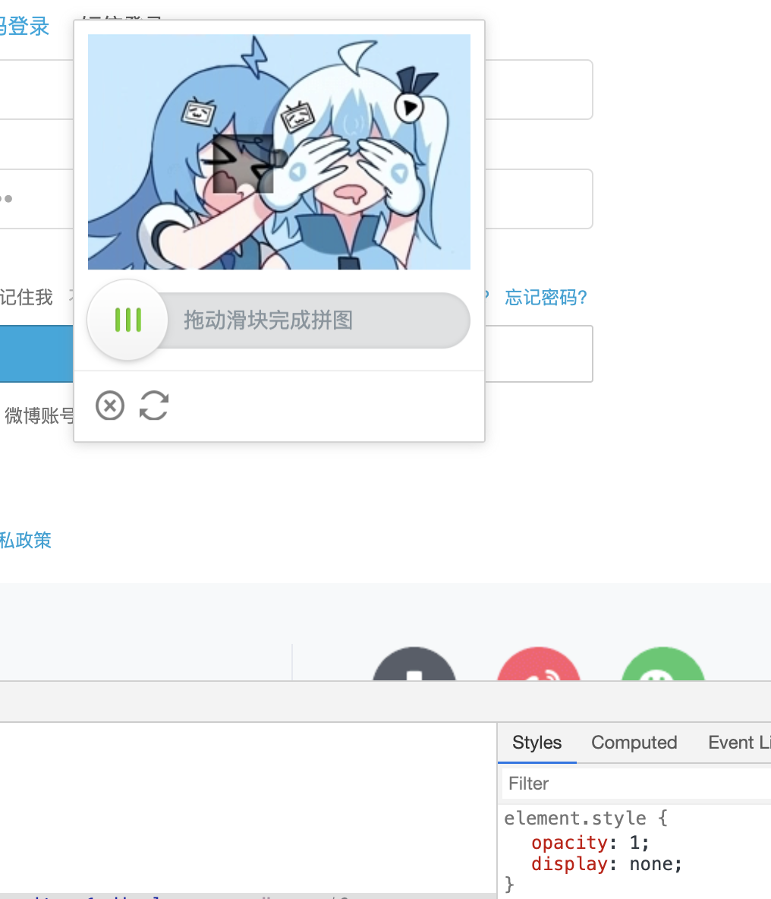
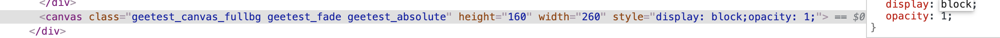
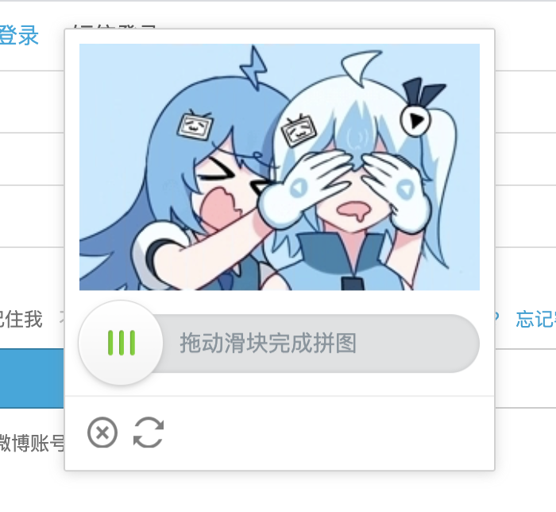

## 哔哩哔哩实战----验证码识别

利用Selenium来模拟B站登录，并实现线极验验证码的识别。


### 初步分析

B站的登录界面如下：


登录需要完成：1、账户输入；2、密码输入；3、**登录后需要通过滑块来进行验证；**

难点就是如何去实现滑块验证并且模仿人的操作。


导入包：

```python
import time
from io import BytesIO
from PIL import Image
from selenium import webdriver
from selenium.webdriver import ActionChains
from selenium.webdriver.common.by import By 
from selenium.webdriver.support import expected_conditions as EC 
from selenium.webdriver.support.wait import WebDriverWait
```


### 初始化

建立实现类，设置账号、密码、浏览器对象、等待对象、url参数，进行初始化：

```python
class bilibili():
	def __init__(self, phone, password):
		"""
		初始化
		:param phone: 账号
		:param password: 密码
		"""
		chrome_options = webdriver.ChromeOptions()
		chrome_options.add_argument('start-fullscreen')
		self.browser = webdriver.Chrome(options=chrome_options)
		self.wait = WebDriverWait(self.browser, 15)
		self.url = 'https://passport.bilibili.com/login'
		self.phone = phone
		self.password = password
```


### 打开B站进行登录

1. 打开B站：`browser.get()`；

2. 查找输入账号、密码、登录节点；
3. 输入账号、密码：`send_keys()`；
4. 点击登录：`click()`；

```python
def open(self):
		"""
		打开网页，输入账号、密码，点击
		"""
		self.browser.get(self.url)
		phone = self.wait.until(EC.presence_of_element_located((By.ID, 'login-username')))
		password = self.wait.until(EC.presence_of_element_located((By.ID, 'login-passwd')))
		button = self.wait.until(EC.element_to_be_clickable((By.CLASS_NAME, 'btn.btn-login')))
		phone.send_keys(self.phone)
		password.send_keys(self.password)
		button.click()
```

完成上述后，就会出现验证图片。


### 滑块验证图片分析

实现滑动验证，首先是需要**找到移动的位置**，这是关键。

思路是：**找到残缺图和原图，进行像素的比较，找到不同的位置（相差大于某个阈值）**

1、如何显示残缺图（不带🧩）和原图？

我们通过谷歌，检查，找到验证图片，分析它内部结构，结果我们发现：

若我们将以下的`display`属性改为`none`，则🧩会消失：



效果：



若将以下的`display`属性改为`none`，则会得到原图：



效果：



实现上述属性的更改，我们可以通过**执行JS语句**进行实现：

```python
self.browser.execute_script("document.getElementsByClassName('geetest_canvas_slice geetest_absolute')[0].style.display='none'")
self.browser.execute_script("document.getElementsByClassName('geetest_canvas_fullbg geetest_fade geetest_absolute')[0].style['display'] = 'block'")
```

2、如何正确捕捉到两张图呢？

我们可以通过Selenium工具来**对当前页面进行截图，再去找到图片对应的位置，进行切割，即可完成图片的获取**，下面将详细说明。


### 页面截图

截图函数：`get_screenshot_as_png()`，得到的是二进制数据；通过`BytesIO`进行转换为Image可接受的格式；

因为最初的得到的形式如下：

`<PIL.PngImagePlugin.PngImageFile image mode=RGBA size=2880x1554 at 0x102027828>`

为RGBA格式（四维），我们将其转为最常用的RGB格式；

```python
	def get_screenshot(self):
	    """
	    获取网页截图
	    :return: 截图对象
	    """
	    screenshot =  self.browser.get_screenshot_as_png()
	    screenshot = Image.open(BytesIO(screenshot))
	    screenshot = screenshot.convert('RGB')
	    return screenshot
```


### 截取页与浏览器页大小问题

最初未考虑到这点，每次截取的图片全为白色，还以为截图函数出了错误，但后来发现，截取页和浏览器页本身大小不一样；

通过：`self.browser.get_window_size()`获取浏览器页面大小；

通过：`self.get_screenshot().size`获取截图大小；

结果如下：

```
{'width': 1440, 'height': 900}
(2880, 1554)
```

发现确实大小不同，给我们定位图片位置带来了困扰；

**我们得到的是浏览器中图片的位置，我们需要将其转化为截图上的位置，进行切割下来，最后滑块移动的位置又需要转化到浏览器的距离**

所以我们需要一个方法来得到**比例**：经过实践，**发现宽和高都是和宽的比例有关**，不懂为什么。

```python
def get_scale(self):
		"""
		截取页与浏览器的宽比例
		:return: 比例
		"""
		screenshot = self.get_screenshot()
		size1 = screenshot.size
		size2 = self.browser.get_window_size()
		# 网页与截图比例，主要是宽的影响（不知道为什么）
		scale = size1[0]/size2['width']
		return scale
```


### 获取验证图位置信息

获取对应图片节点，得到该节点的位置（左上角坐标），再获取该图片节点的大小，通过两个条件和上述所说的比例，计算图片的上下左右边界；

```python
	def get_position(self, scale):
		"""
		获取验证码位置
		:return: 验证码位置元组
		"""
		img = self.wait.until(EC.presence_of_element_located((By.CLASS_NAME, 'geetest_slicebg.geetest_absolute')))
		location = img.location
		size = img.size
		top, bottom, left, right = location['y'] * scale, (location['y'] + size['height']) * scale,\
		 location['x'] * scale, (location['x'] + size['width']) * scale
		return top, bottom, left, right
```


### 切割图片

得到整张浏览器截图，和图片位置，我们可以从截图中继续截取我们需要的部分。

通过`Image`模块中的`crop`方法进行截取；

```python
	def get_geetest_image(self):
		"""
		获取验证码图片
		:return: 图片对象
		"""
		screenshot = self.get_screenshot()
		scale = self.get_scale()
		top, bottom, left, right = self.get_position(scale)
		image = screenshot.crop((left, top, right, bottom))
		return image
```


### 获取残缺图（不带🧩）和原图

整合上述方法，我们来获取两张图片。

设置等待⌛️时长2秒，是因为需要图片进行刷新得到。（当然可以通过延时等待条件进行判断）

```python
	def get_two_images(self):
		"""
		获得两张图片
		:return: 两个Image对象
		"""
		time.sleep(2)
		self.browser.execute_script("document.getElementsByClassName('geetest_canvas_slice geetest_absolute')[0].style.display='none'")
		image1 = self.get_geetest_image()
		self.browser.execute_script("document.getElementsByClassName('geetest_canvas_fullbg geetest_fade geetest_absolute')[0].style['display'] = 'block'")
		image2 = self.get_geetest_image()
		return image1, image2
```

结果：


### 移动位置分析

完成了图片的获取，接下来关键的是**滑块该移动到哪个位置**。

上述我们说到，通过两张图片的差异，具体来说就是通过每个点的RGB值的比较，若总和大于某个阈值，则判断为需要移动到的位置；

这里我们不对图片进行处理，如灰度化、二值化等（虽然缺失地方是偏暗的）；

遍历问题：

起初我是一行一行遍历，并进行跳格（提高判别速度），但后来移动出错发现，**我们需要找到最左的位置，🧩有个地方是凸出来的），按上述遍历，并不能找到该位置，故改为一列一列遍历**


### 单个元素判断

`load()`方法能获取[x, y]点的RGB值；

设置阈值为60

```python
	def is_pixel_equal(self, image1, image2, x, y):
	    """
	    判断两个像素是否相同
	    :param image1: 带缺口图片
	    :param image2: 原图
	    :param x: 位置x
	    :param y: 位置y
	    :return: 像素是否相同
	    """
	    # 取两个图片的像素点
	    pixel1 = image1.load()[x, y]
	    pixel2 = image2.load()[x, y]
	    threshold = 60
	    if abs(pixel1[0] - pixel2[0]) < threshold and abs(pixel1[1] - pixel2[1]) < threshold and abs(
	            pixel1[2] - pixel2[2]) < threshold:
	        return True
	    else:
	        return False
```


### 获得移动位置

```python
	def get_gap(self, image1, image2):
	    """
	    获取移动位置
	    :param image1: 带缺口图片
	    :param image2: 原图
	    :return:
	    """
	    for i in range(0, image1.size[0]):
	        for j in range(image1.size[1]):
	            if not self.is_pixel_equal(image1, image2, i, j):
	                return i
	    return 0
```

**当然得到移动位置后，需要转化为浏览器的相对位置**


### 滑块移动分析

首先需要获取滑块对象；然后通过Selenium的动作链来拖动滑块移动到指定位置；

但**如何不让浏览器认为是机器拖动呢**，正常人为移动滑块是**先加速后减速**，我们需要模仿这个行为；

故我们只要去写一个**加速运动再减速运动的函数就行了**，记录每次移动的位置；


### 构造移动轨迹

设置减速位置为：距离的4/5处。

**时间间隔进行随机化**（重要）

**注意：**或移动位置+当前位置大于目标位置时，需要修正移动位置。

```python
	def get_track(self, distance):
		"""
	    根据偏移量获取移动轨迹
	    :param distance: 偏移量
	    :return: 移动轨迹
	    """
		# 移动轨迹
		track = []
		# 当前位移
		current = 0
		# 减速阈值
		mid = distance * 4 / 5
		# 初速度
		v0 = 5
		while current < distance:
			if current < mid:
				a = 5
			else:
				a = -4
			# 间隔
			t = random.randint(3, 6) / 10
			# 移动距离
			move = v0 * t + 0.5 * t * t
			# 当前速度
			v0 = v0 + a * t
			if current + move >= distance:
				move = distance - current
			current += move
			track.append(move)
		return track
```


### 获取滑块对象

```python
	def get_slider(self):
		"""
		获取滑块
		:return: 滑块对象
		"""
		slider = self.wait.until(EC.element_to_be_clickable((By.CLASS_NAME, 'geetest_slider_button')))
		return slide
```


### 移动滑块到指定位置

ActionChains这个模块的实现的核心思想就是，当你调用ActionChains的方法时，不会立即执行，而是会将所有的操作按顺序存放在一个List里，当你调用`perform()`方法时，队列中的时间会依次执行

`click_and_hold`：点击并按住当前模块；

`move_by_offset`：移动当前模块；

`release`：释放模块；


```python
	def move_to_gap(self, slider, track):
	    """
	    拖动滑块到缺口处
	    :param slider: 滑块
	    :param track: 轨迹
	    :return:
	    """
	    ActionChains(self.browser).click_and_hold(slider).perform()
	    time.sleep(0.02)
	    for x in track:
	        ActionChains(self.browser).move_by_offset(xoffset=x, yoffset=0).perform()
	        time.sleep(0.01)
	    time.sleep(0.017)
      # 后退，更符合人为操作
	    ActionChains(self.browser).move_by_offset(xoffset=-1, yoffset=0).perform()
	    time.sleep(0.028)
	    ActionChains(self.browser).release().perform()
```


### 主函数

```python
	def start(self):
		"""
		开始
		"""
		# 打开网页
		self.open()
		# 获取残缺图与原图
		image1, image2 = self.get_two_images()
		# 计算需要向右移动的距离
		distance = self.get_gap(image1, image2)
		scale = self.get_scale()
		# 转为浏览器距离
		distance = distance / scale
		# 得到每次移动的距离
		track = self.get_track(distance)
		# 获取滑块
		slider = self.get_slider()
    # 恢复缺口
		self.browser.execute_script("document.getElementsByClassName('geetest_canvas_slice geetest_absolute')[0].style.display='block'")
		# 移动滑块
		self.move_to_gap(slider, track)
```


### 结果

并不能保证每次成功，主要是在移动方面的参数进行调整，更符合人为。

