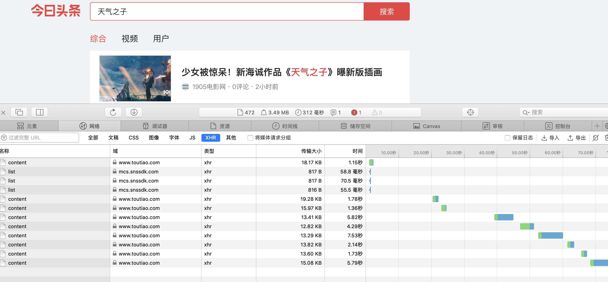
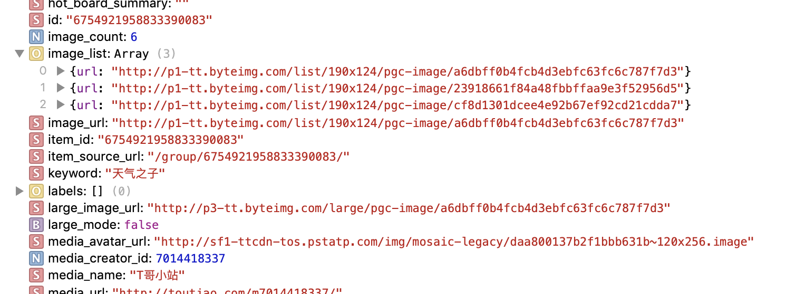
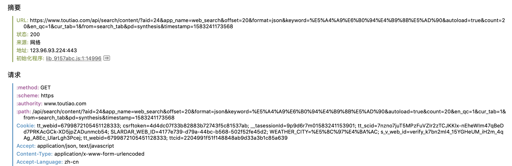
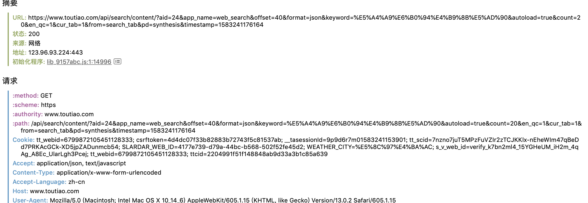

## 头条搜索关键词，爬取相关图片

头条的爬取设计Ajax数据的爬取。

导入包：

```python
import requests
import time
import os
import re
from hashlib import md5
from urllib.parse import urlencode
from multiprocessing.pool import Pool
```


### 分析

打开Chrome/Safrai中的检查---网络，在头条官网上进行搜索，例如：天气之子，向下滚动，加载所有的信息，如下所示：



选择**XHR**，进行预览，分析**data**，我们主要是获取图片和它的标题（方便分类保存），如下所示：



我们观察发现：

- 图片的url都属于**image_list**字段，且data中表明了大图片的url格式，我们可以对提取的url更改为大图片的url；
- data中有些并不包含image_list或title，可以将这些情况去除；


### 加载单个Ajax请求

对请求头部进行分析：





通过对两个URL的格式分析，**变化的参数只有offset**，它的变化规律为0，20，40，...我们可以推断出它是一个偏移量，故我们可以设置参数offset，方便后续去加载所有的Ajax请求。

时间戳进行构造：`		'timestamp' : int(time.time_ns() / (10**6)) `，好像并不重要。


请求头部需要添加**cookie**，不然返回为空。

`urlencode`：将参数进行序列化；

返回爬取页面的json形式，在对其进行解析时就不需要解析库进行分析了；

```python
def get_page(offset):
	params = {
		'aid': 24,
		'app_name': 'web_search',
		'offset': offset,
		'format': 'json',
		'keyword': '天气之子',
		'autoload': 'true',
		'count': 20,
		'en_qc': 1,
		'cur_tab': 1,
		'from': 'search_tab',
		'pd': 'synthesis',
		'timestamp' : int(time.time_ns() / (10**6))
	}
	headers = {
	# cookie加入重中之重
	'cookie': ('__tasessionId=q6mp1lrxu1583224640956;' 
		'csrftoken=4d4dc07f33b82883b72743f5c81537ab;' 
		's_v_web_id=verify_k7bn2ml4_15YGHeUM_iH2m_4qAg_A8Ec_UlarLgh3Pcej;' 
		'SLARDAR_WEB_ID=4177e739-d79a-44bc-b568-502f52fe45d2;' 
		'tt_scid=7nzno7juT5MPzFuVZIr2zTCJKKlx-nEheWIm47qBeDd7PRKAcGCk-XD5jpZADunmcb54;' 
		'tt_webid=6799872105451128333;' 
		'tt_webid=6799872105451128333;' 
		'ttcid=2204991f51f148848ab9d33a3b1c85a639;' 
		'WEATHER_CITY=%E5%8C%97%E4%BA%AC'),
	'User-Agent': 'Mozilla/5.0 (Macintosh; Intel Mac OS X 10_11_4) AppleWebKit/537/36'+
	'(KHTML, like Gecko) Chrome/52.0.2743.116 Safari/537/36'
	}
	url = 'https://www.toutiao.com/api/search/content/?' + urlencode(params)
	try:
		res = requests.get(url, headers=headers)
		if res.status_code == 200:
			return res.json()
	except requests.ConnectionError:
		return None
```


### 获取图片

返回的json为一个字典，我们需要它key为‘data’的value，对data进行遍历：

- 首先判断当前是否存在title和image_list字段，不存在则跳过；
- 获取title和image_list对应的值，接着需要遍历image_list：
  - 通过上述对图片的分析，我们需要大图片，故通过re.sub()方法对部分字符进行替换，因为存在两种格式，故分别进行分析替换
- 将图片和标题进行返回，此时来**构造一个生成器**（发现比直接使用list好用多了）

```python
def get_images(json):
	if json.get('data'):
		for item in json.get('data'):
			if item.get('title') and item.get('image_list'):
 				title = item.get('title')
 				images = item.get('image_list')
 				for image in images:
 					if "190x124" in image.get('url'):
 						image_url = re.sub('list/190x124', 'large', image.get('url'))
 					else:
 						image_url = re.sub('list', 'large', image.get('url'))
 					yield{
 					'image': image_url,
 					'title': title
 					}
```


### 保存图片

我们将所有的内容放在`data/tianqizhizi`下，并将每一个标题作为一个文件夹，生成对应目录；

通过图片的url获取对应的二进制信息。

**图片的名称可以使用其内容的 MD5 值，这样可以去除重复**。

将二进制内容写入。

```python
def save_images(item):
	path = 'data/tinaiqzhizi/' + item.get('title')
	if not os.path.exists(path):
		os.makedirs(path)
	try:
		res = requests.get(item.get('image'))
		if res.status_code == 200:
			print(item)
			file_path = '{0}/{1}.{2}'.format(path, 
				md5(res.content).hexdigest(), 'png')
			if not os.path.exists(file_path):
				with open(file_path, 'wb') as f:
					f.write(res.content)
			else:
				print('Already Download', file_path)
	except requests.ConnectionError:
		print('Falied to Save Image')
```


### 主函数

加载单个ajax后保存图片：

```python
def main(offset):
	json = get_page(offset)
	for item in get_images(json):
		save_images(item)
```


**实现多进程进行下载。**

```python
if __name__ == '__main__':
	pool = Pool()
	groups = [x * 20 for x in range(0, 9)]
	pool.map(main, groups)
	pool.close()
	pool.join()
```

