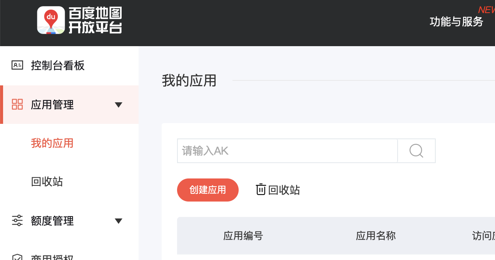
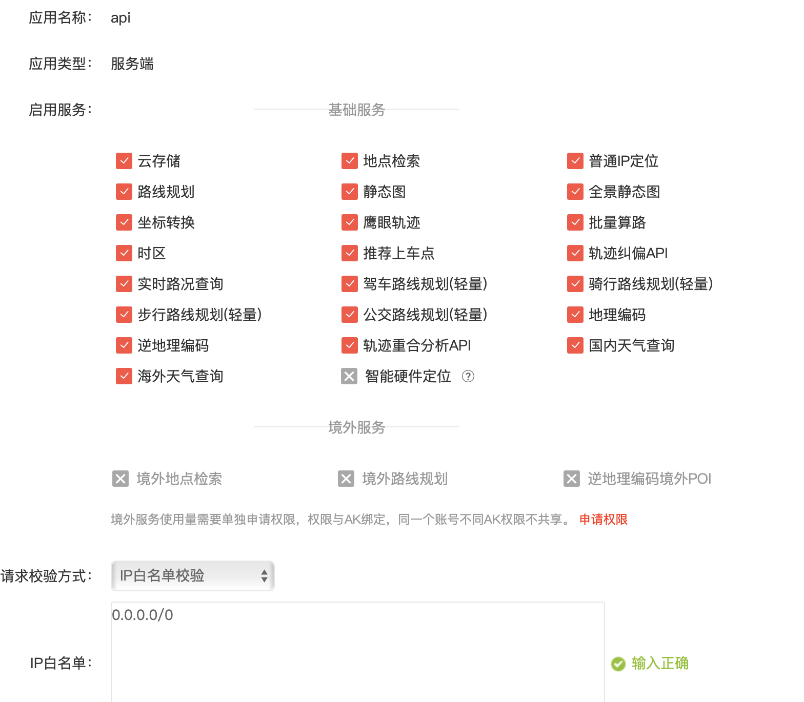
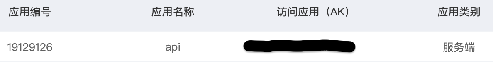
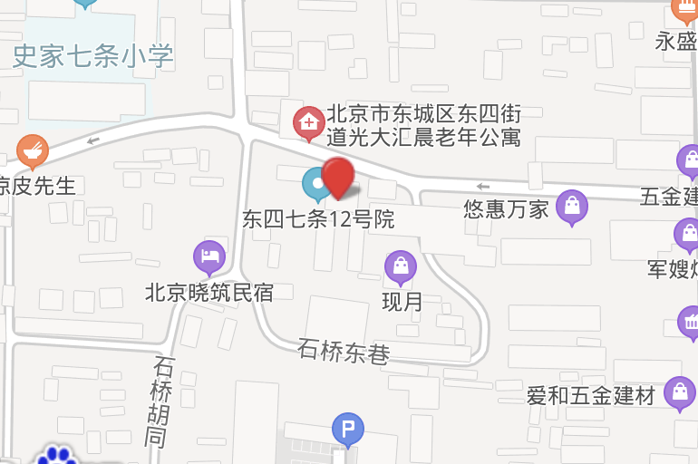

## 百度API


### 获取AK

首先我们打开百度API开放平台，注册/登陆自己的账号，成为百度开发者，在「应用管理」--- 「我的应用」中创建应用，如下所示：



在「创建应用」中输入「应用名称」，并且「请求校验方式」选择「IP白名单交验」，这里我们不使用「sn校验方式」，因为需要计算sn，并且为了方便，IP白名单选择了“0.0.0.0/0”，不对IP进行限制（这里是为了Debug，如果想要上线，请设置合理的IP白名单），然后提交即可。



在「我的应用」中出现如下应用：



「访问应用（AK）」是我们所需的。


### 获取地址对应的经纬度----地理编码

查看百度开放平台中的「开发文档」---「Web服务API」，选择「地点输入提示」---「地理编码」，我们可以找到地理编码接口的url：

```
http://api.map.baidu.com/geocoding/v3/?address=北京市海淀区上地十街10号&city=北京市&output=json&ak=您的ak&callback=showLocation //GET请求
```

其中：

- address：所查询的地名；
- city：查询地区的城市，「可以省略」，主要是为了限定地区排除部分城市地区重名问题；
- json：输出格式为json格式，方便后期获取地址；
- ak：即上面我们获取的API Key；

完整的请求参数如下：

|    参数名     |                           参数含义                           | 类型   |                      举例                       | 默认值                   | 是否必须 |
| :-----------: | :----------------------------------------------------------: | ------ | :---------------------------------------------: | ------------------------ | -------- |
|    address    | 待解析的地址。最多支持84个字节。<br/>可以输入两种样式的值，分别是： <br/>1、标准的结构化地址信息，如北京市海淀区上地十街十号 【推荐，地址结构越完整，解析精度越高】<br/>2、支持“*路与*路交叉口”描述方式，如北一环路和阜阳路的交叉路口<br/>第二种方式并不总是有返回结果，只有当地址库中存在该地址描述时才有返回。 | string |            北京市海淀区上地十街10号             | 无                       | **是**   |
|     city      | 地址所在的城市名。用于指定上述地址所在的城市，当多个城市都有上述地址时，该参数起到过滤作用，但不限制坐标召回城市。 | string |                     北京市                      | 无                       | 否       |
| ret_coordtype | 可选参数，添加后返回国测局经纬度坐标或百度米制坐标 [坐标系说明](http://lbsyun.baidu.com/index.php?title=coordinate) | string | gcj02ll（国测局坐标）、bd09mc（百度墨卡托坐标） | bd09ll（百度经纬度坐标） | 否       |
|      ak       | 用户申请注册的key，自v2开始参数修改为“ak”，之前版本参数为“key”[申请ak](https://lbsyun.baidu.com/apiconsole/key/create) | string |                                                 | 无                       | **是**   |
|      sn       | 若用户所用ak的校验方式为sn校验时该参数必须  [sn生成](https://lbsyun.baidu.com/index.php?title=webapi/appendix) | string |                                                 | 无                       | 否       |
|    output     |                    输出格式为json或者xml                     | string |                    json或xml                    | xml                      | 否       |
|   callback    |    将json格式的返回值通过callback函数返回以实现jsonp功能     | string |                                                 | 无                       | 否       |

主要的返回结果参数为：

| 名称     | 含义                                                         | 类型   |
| -------- | ------------------------------------------------------------ | ------ |
| status   | 返回结果状态值， 成功返回0，其他值请查看下方返回码状态表。   | int    |
| location | 经纬度坐标（包含lng和lat）                                   | object |
| precise  | 位置的附加信息，是否精确查找。1为精确查找，即准确打点；0为不精确，即模糊打点。 | int    |
| level    | 能精确理解的地址类型，包含：UNKNOWN、国家、省、城市、区县、乡镇、村庄、道路、地产小区、商务大厦、政府机构、交叉路口、商圈、生活服务、休闲娱乐、餐饮、宾馆、购物、金融、教育、医疗 、工业园区 、旅游景点 、汽车服务、火车站、长途汽车站、桥 、停车场/停车区、港口/码头、收费区/收费站、飞机场 、机场 、收费处/收费站 、加油站、绿地、门址 | string |


接下来我们使用「request包」爬取对应的json内容：

```python
def BaiduQuery(address, currentkey):
	"""
	:param address: address
	:param currentkey: AK
	"""
  url = 'http://api.map.baidu.com/geocoding/v3/?'
  params = {
    "address": address,
    "city": '北京市',
    "output": 'json',
    "ak": currentkey,
  }
  response = requests.get(url, params=params)
  answer = response.json()
```

以北京东四地区为例，执行函数：

```python
BaiduQuery('东四', currentkey="sLTKStSk6QGaAK2XriSseziy9FghVXkV")
```

得到的json结果如下：

```
{'status': 0, 'result': {'location': {'lng': 116.43043084078596, 'lat': 39.93757214936878}, 'precise': 0, 'confidence': 50, 'comprehension': 100, 'level': '商圈'}}
```

分析json数据，我们需要的内容应该是「result」中的「location」中的「lng（经度）」和「lat（纬度）」，当然你也可以获取其他信息。

查询该经纬度：



结果正确！

结合上述分析，最终我们的代码如下：

```python
def BaiduQuery(address, currentkey):
    """
    address convert lat and lng
    :param address: address
    :param currentkey: AK
    :return: places_ll
    """
    url = 'http://api.map.baidu.com/geocoding/v3/?'
    params = {
        "address": address,
        "city": '北京市',
        "output": 'json',
        "ak": currentkey,
    }
    response = requests.get(url, params=params)
    answer = response.json()
    if answer['status'] == 0:
        tmpList = answer['result']
        coordString = tmpList['location']
        coordList = [coordString['lng'], coordString['lat']]
        places_ll.append([address, float(coordList[0]), float(coordList[1])])
        print([address, float(coordList[0]), float(coordList[1])])
    else:
        return -1
```

地址：

```
	l = ['东四',	'天坛', '官园', '万寿公园', '奥体中心',	'农展馆',
		'万柳', '北部新区', '丰台花园',	'云岗',	'石景山古城', '房山', '大兴',
		'亦庄',	'通州',	'顺义',	'昌平',	'门头沟',	 '平谷',	'怀柔',
		'密云',	'延庆',	'定陵',	'八达岭',	 '密云水库',	'东高村', 
		'永乐店', '榆垡',	 '琉璃河', '前门', '永定门内', 	'西直门北',	
		'南三环', '东四环']
```

结果：

```
['东四', 116.430431, 39.937572]
['天坛', 116.419342, 39.888663]
['官园', 116.37293, 39.933926]
['万寿公园', 116.37434, 39.885845]
['奥体中心', 116.406138, 39.990549]
['农展馆', 116.473398, 39.943151]
...
['南三环', 116.38953, 39.864106]
['东四环', 116.494326, 39.895722]
```

注意：

地址的名字相当关键，当你自己使用百度地图时，输入地址，百度会帮你进行「联想修正」，但你通过百度API进行查找时，地址不匹配的话，它会返回一个默认的经纬度：`116.413384,39.910925`，这里我举例北京市的地区，要是限定其他地区，返回的默认经纬度可以自行测试（看经纬度相同的数量）。举例：

「万寿公园」这个地名我之前得到的是「万寿西宫」，结果无法匹配，查找资料后，才知道在百度地图上匹配的是万寿公园。


可以通过比较经纬度的方法，人工进行地名的修正（其他方法没有想到，我自己查找了1000多条地名，自己修正了400多例）


### 获取经纬度对应的地址---逆地理编码

查看「全球逆地理编码」，我们可以找到逆地理编码接口的url：

```
http://api.map.baidu.com/reverse_geocoding/v3/?ak=您的ak&output=json&coordtype=wgs84ll&location=31.225696563611,121.49884033194  //GET请求
```

主要的请求参数为：

| 参数名    | 参数含义                                                     | 类型   | 举例                                  | 默认值 | 是否必须 |
| --------- | ------------------------------------------------------------ | ------ | ------------------------------------- | ------ | -------- |
| location  | 根据经纬度坐标获取地址。                                     | float  | 38.76623,116.43213lat<纬度>,lng<经度> | 无     | **是**   |
| coordtype | 坐标的类型，目前支持的坐标类型包括：bd09ll（百度经纬度坐标）、bd09mc（百度米制坐标）、gcj02ll（国测局经纬度坐标，仅限中国）、wgs84ll（ GPS经纬度） [坐标系说明](http://lbsyun.baidu.com/index.php?title=coordinate) | string | bd09ll、gcj02ll                       | bd09ll | 否       |
| ak        | 用户申请注册的key，自v2开始参数修改为“ak”，之前版本参数为“key” [申请ak](http://lbsyun.baidu.com/apiconsole/key/create) | string | E4805d16520de693a3fe70                | 无     | **是**   |
| output    | 输出格式为json或者xml                                        | string | json或xml                             | xml    | 否       |

主要的返回参数：

| 名称              | 含义                                                         | 类型   |
| ----------------- | ------------------------------------------------------------ | ------ |
| status            | 返回结果状态值， 成功返回0，其他值请查看下方返回码状态表。   | int    |
| location          | 经纬度坐标                                                   | object |
| formatted_address | 结构化地址信息                                               | string |
| business          | 坐标所在商圈信息，如 "人民大学,中关村,苏州街"。最多返回3个。 | string |

代码如下：

```python
def reverse_geocoding(lng, lat, currentkey):
    """
    lat and lng convert address
    :param lng: longitude
    :param lat: latitude
    :param currentkey: AK
    :return: places_ll
    """
    url = 'http://api.map.baidu.com/reverse_geocoding/v3/?'
    params = {
        "location": str(lat)+','+str(lng),
        "output": 'json',
        "ak": currentkey,
        "coordtype": "wgs84ll",
    }
    response = requests.get(url, params=params)
    answer = response.json()
    if answer['status'] == 0:
        tmpList = answer['result']
        address = tmpList['formatted_address']
        print([lng, lat, address])
        places_ll.append([address, lng, lat])
    else:
        return -1
```

以东四的经纬度为例，json结果为：

```
{'status': 0, 'result': {'location': {'lng': 116.44318395258946, 'lat': 39.94483923411242}, 'formatted_address': '北京市东城区东中街16号', 'business': '东四,东直门,东四十条', 'addressComponent': {'country': '中国', 'country_code': 0, 'country_code_iso': 'CHN', 'country_code_iso2': 'CN', 'province': '北京市', 'city': '北京市', 'city_level': 2, 'district': '东城区', 'town': '', 'town_code': '', 'adcode': '110101', 'street': '东中街', 'street_number': '16号', 'direction': '附近', 'distance': '23'}, 'pois': [], 'roads': [], 'poiRegions': [], 'sematic_description': '', 'cityCode': 131}}
```

最后输出：

```
[116.430431, 39.937572, '北京市东城区东中街16号']
```

